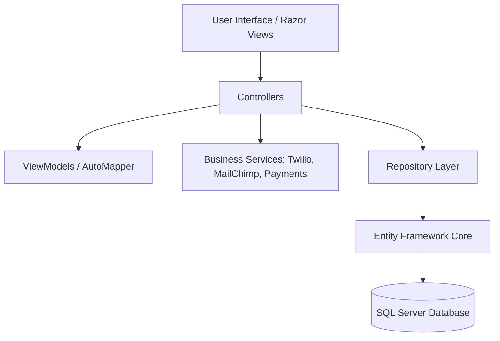
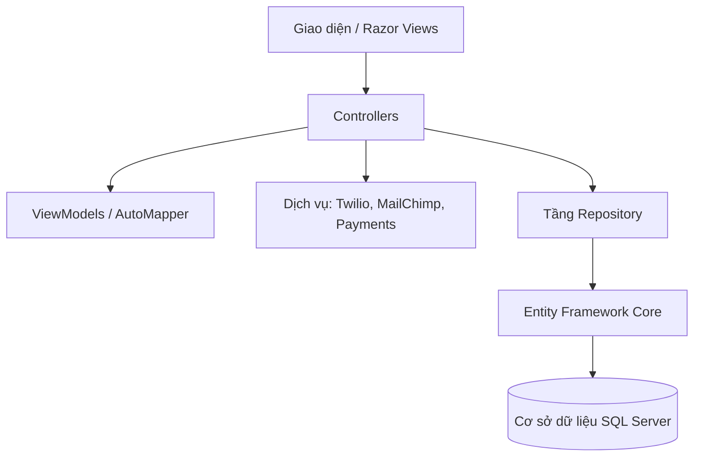

<div align="center">
  <h1>🧳 Luggage Sales Management - E-Commerce Platform</h1>
  <h3>An Enterprise-Grade, Full-Stack E-Commerce Web Application built with .NET 8</h3>

  <p align="center">
    
    
    
    
    
    
    
  </p>

  <p>
    <i>[Tiếng Việt bên dưới / Vietnamese version below]</i>
  </p>
</div>

<details open>
<summary><h2>🇺🇸 English Version</h2></summary>

### 1. 🌟 Project Overview
This project is a highly scalable, robust, and feature-rich E-commerce web application specifically designed for a **Luggage Sales Management** business. Developed with **ASP.NET Core 8 MVC**, it goes beyond a simple storefront by providing an enterprise-grade architecture. It features a comprehensive suite of tools including multi-gateway payment integrations, automated marketing campaigns, real-time SMS notifications, Identity-based secure authentication, and a powerful administrative portal for daily business operations.

### 2. 🏗️ System Architecture & Design Patterns

The application is built on modern software engineering principles to ensure maintainability and scalability:
*   **MVC Architecture:** Clean separation of concerns between Models (Data), Views (UI), and Controllers (Logic).
*   **Repository Pattern:** Abstracts data access logic (`ILoaiSpRepository`, etc.), making the codebase modular and testable without tightly coupling business logic to Entity Framework Core.
*   **Dependency Injection (DI):** Centralized service registration in `Program.cs` for loosely coupled components (Services, Repositories, API Clients).
*   **ViewComponents:** Modular and reusable UI widgets (e.g., dynamic Category Menus, Shopping Cart summaries) rendered independently of the main controller flow.
*   **Data Transfer Objects (DTOs) & AutoMapper:** Utilizes ViewModels and `AutoMapper` to securely pass data between the UI and domain entities, preventing over-posting vulnerabilities.



### 3. ✨ Comprehensive Feature Matrix

#### 🛍️ Customer Experience (Storefront)
| Feature | Description |
| :--- | :--- |
| **Smart Catalog** | Dynamic product browsing with category filtering and highly optimized server-side pagination using `X.PagedList`. |
| **Session-Based Cart** | Frictionless shopping cart experience stored in secure HTTP Sessions, allowing users to build carts before logging in. |
| **Social Login** | Secure, 1-click login and registration powered by **Google OAuth** alongside standard ASP.NET Identity authentication. |
| **User Dashboard** | Personalized dashboard for customers to track order history, view order statuses, and manage their profile. |

#### 💳 Payments & Checkout
| Provider | Integration Status & Details |
| :--- | :--- |
| **Stripe** | 🟢 **Fully Integrated:** Direct API integration using `Stripe.net` `SessionCreateOptions` for secure credit card processing and automated callback webhooks (`SuccessStripe`). |
| **PayPal** | 🟢 **Fully Integrated:** Utilizes PayPal REST API v2 (`PaypalClient`) for capturing orders dynamically with real-time UI updates. |
| **COD** | 🟢 **Fully Integrated:** Cash On Delivery as the standard, flexible option for local customers. |
| **VNPay / MoMo** | 🟡 **Prepared:** Infrastructure and callback handlers exist in the codebase, ready for final DI configuration. |

#### 📢 Marketing, CRM & Communications
| Tool | Capabilities Implemented |
| :--- | :--- |
| **MailChimp** | **Email Marketing Automation:** Syncs registered users to MailChimp Audiences. Enables automated newsletters, promotional campaigns, and targeted customer engagement directly from the platform. |
| **Twilio** | **Real-Time SMS Alerts:** Instantly notifies customers via SMS upon successful order placement. Ready to handle shipping status updates and OTP verification. |
| **SendGrid / FakeEmail** | **Transactional Emails:** Infrastructure established (via `IEmailSender`) for password resets, email confirmations, and order receipts. |

#### ⚙️ Administrative Portal (Admin Area)
*   **Secure Access:** Protected by `[Authorize(Roles = "Admin")]`.
*   **Dynamic Data Seeding:** The `DataSeeder` automatically provisions default Admin accounts and system Roles upon the first launch.
*   **Advanced CRUD Management:** Complete control over Catalog hierarchy (Products, Categories, Brands, Materials, Countries) utilizing Rich Text interfaces and image uploads.
*   **Order Fulfillment:** Comprehensive pipeline to view incoming orders, verify payment statuses (Paid via Stripe/PayPal vs Pending COD), and update shipping statuses.

### 4. 📂 Project Structure

```text
Ecommerce.sln               # Visual Studio Solution
├── QLBanHangVali.sql       # SQL Database Bootstrap Script
├── README.md               # Project documentation
└── Ecommerce/              # Main Application Project
    ├── Areas/Admin/        # Admin Area (Protected routes, Controllers, Views)
    ├── Controllers/        # Storefront Controllers (Cart, Checkout, Home, Product)
    ├── Data/               # Entity Framework ApplicationDbContext & Identity setup
    ├── Helpers/            # Utilities (PaypalClient, TwilioService, MySettings, AutoMapperProfile)
    ├── Models/             # Domain Entities (ApplicationUser, THoaDonBan, etc.)
    ├── Repositories/       # Repository Pattern implementations (e.g., ILoaiSpRepository)
    ├── Services/           # Third-party Integrations (EmailSender, SMS, etc.)
    ├── ViewComponents/     # Reusable UI widgets (Menu, Cart preview)
    ├── ViewModels/         # Secure Data Transfer Objects (CheckoutVM, CartItemVM)
    ├── Views/              # Razor Pages (UI for customers)
    ├── wwwroot/            # Static Assets (CSS, JS, Uploaded Images)
    └── Program.cs          # Pipeline configuration, DI container, and Startup logic
```

### 5. 🚀 Getting Started & Installation

1.  **Database Provisioning:** 
    *   Execute the `QLBanHangVali.sql` script within SQL Server Management Studio to create the schema and seed initial demo data.
    *   *Alternatively*, run `Update-Database` via Package Manager Console if utilizing EF Migrations.
2.  **Environment Configuration:** 
    *   Duplicate `appsettings.example.json` and rename it to `appsettings.json`.
    *   Inject your secure credentials:
        *   **SQL Server:** `DefaultConnection` string.
        *   **Google OAuth:** `ClientId` and `ClientSecret`.
        *   **Stripe:** `SecretKey` and `PublishableKey`.
        *   **PayPal:** `PaypalOptions:AppId` and `AppSecret`.
        *   **Twilio:** `AccountSID`, `AuthToken`, and `FromPhoneNumber`.
        *   **MailChimp:** `ApiKey` and `AudienceId`.
3.  **Launch:** 
    *   Open `Ecommerce.sln` in Visual Studio and hit `F5`.
    *   *Alternatively*, open a terminal in the `Ecommerce` directory and execute `dotnet run`.
    *   *Note:* The system will automatically seed an Admin account if one does not exist.

### 6. 🎓 Acknowledgments & Authorship

*   **Team Members:**
    *   Pham Nguyen Phuc An (Primary Author)
    *   Tran Nguyen Quoc Anh
    *   Nguyen Quang Binh
*   **Advisor / Instructor:** M.Sc. Luong Tran Hy Hien

</details>

---

<details open>
<summary><h2>🇻🇳 Tiếng Việt</h2></summary>

### 1. 🌟 Tổng quan Dự án
Dự án này là một nền tảng Thương mại Điện tử full-stack cấp doanh nghiệp, được thiết kế chuyên biệt cho mô hình **Quản lý Bán hàng Vali**. Được phát triển trên nền tảng **ASP.NET Core 8 MVC**, hệ thống không chỉ là một website bán hàng thông thường mà còn sở hữu kiến trúc phần mềm chuẩn mực. Nó cung cấp bộ công cụ mạnh mẽ bao gồm: đa cổng thanh toán quốc tế, tự động hóa marketing, thông báo SMS theo thời gian thực, bảo mật người dùng đa lớp và một cổng quản trị toàn diện.

### 2. 🏗️ Kiến trúc Hệ thống & Design Patterns

Ứng dụng được xây dựng dựa trên các nguyên tắc công nghệ phần mềm hiện đại nhằm đảm bảo tính dễ bảo trì và khả năng mở rộng:
*   **Kiến trúc MVC:** Phân tách rõ ràng giữa Dữ liệu (Models), Giao diện (Views), và Logic điều khiển (Controllers).
*   **Repository Pattern:** Trừu tượng hóa tầng truy cập dữ liệu (`ILoaiSpRepository`,...), giúp code module hóa, dễ dàng test và không bị phụ thuộc cứng vào Entity Framework.
*   **Dependency Injection (DI):** Đăng ký tập trung các dịch vụ tại `Program.cs`, giúp hệ thống liên kết lỏng lẻo (Services, Repositories, APIs).
*   **ViewComponents:** Các Widget giao diện độc lập (như Menu Danh mục, Tóm tắt Giỏ hàng) có thể tái sử dụng ở bất kỳ đâu mà không phụ thuộc vào Controller chính.
*   **DTOs & AutoMapper:** Sử dụng ViewModels kết hợp `AutoMapper` để vận chuyển dữ liệu an toàn giữa UI và Database, chống lại các cuộc tấn công over-posting.



### 3. ✨ Chi tiết Tính năng Toàn diện

#### 🛍️ Trải nghiệm Khách hàng (Storefront)
| Tính năng | Mô tả chi tiết |
| :--- | :--- |
| **Danh mục Thông minh** | Khám phá sản phẩm linh hoạt với bộ lọc danh mục và hệ thống phân trang tối ưu ở backend bằng `X.PagedList`. |
| **Giỏ hàng Session** | Trải nghiệm mua sắm không độ trễ với giỏ hàng lưu trữ bằng Session, cho phép khách hàng chọn món trước khi đăng nhập. |
| **Đăng nhập Mạng xã hội** | Đăng nhập và đăng ký siêu tốc, an toàn chỉ với 1 click thông qua **Google OAuth** kết hợp ASP.NET Identity. |
| **Trang cá nhân (Dashboard)** | Không gian riêng cho khách hàng theo dõi lịch sử mua hàng, trạng thái vận chuyển và cập nhật hồ sơ cá nhân. |

#### 💳 Thanh toán & Trả tiền
| Nhà cung cấp | Trạng thái tích hợp |
| :--- | :--- |
| **Stripe** | 🟢 **Tích hợp 100%:** Kết nối API trực tiếp qua `Stripe.net`, tự động tạo `SessionCreateOptions` và xử lý webhook gọi lại (`SuccessStripe`) để lưu đơn. |
| **PayPal** | 🟢 **Tích hợp 100%:** Sử dụng PayPal REST API v2 (`PaypalClient`) để khởi tạo và capture thanh toán động ngay trên giao diện. |
| **COD** | 🟢 **Tích hợp 100%:** Hình thức thanh toán tiền mặt khi nhận hàng mặc định và linh hoạt. |
| **VNPay / MoMo** | 🟡 **Đã chuẩn bị:** Hạ tầng và các hàm bắt callback đã được viết sẵn trong source code, sẵn sàng kích hoạt DI. |

#### 📢 Marketing, CRM & Giao tiếp (Communications)
| Công cụ | Khả năng triển khai |
| :--- | :--- |
| **MailChimp** | **Tự động hóa Email Marketing:** Tự động đồng bộ tài khoản khách hàng mới vào tệp Audience của MailChimp. Sẵn sàng cho việc gửi Newsletters, chiến dịch giảm giá, và thiết lập kịch bản bám đuổi giỏ hàng bị bỏ quên. |
| **Twilio** | **Thông báo SMS Tức thì:** Tự động nhắn tin SMS đến điện thoại khách hàng ngay khi đơn hàng được chốt. Hệ thống cũng sẵn sàng mở rộng để thông báo tiến độ giao hàng hoặc gửi mã OTP. |
| **Email Hệ thống** | **Email Giao dịch:** Hạ tầng `IEmailSender` được thiết lập sẵn sàng để gửi link khôi phục mật khẩu, xác thực tài khoản và biên lai đơn hàng. |

#### ⚙️ Cổng Quản trị (Admin Area)
*   **Bảo mật Truy cập:** Phân quyền nghiêm ngặt bằng `[Authorize(Roles = "Admin")]`.
*   **Khởi tạo Dữ liệu Động (Data Seeding):** Tính năng `DataSeeder` tự động sinh tài khoản Admin gốc và cấu trúc Vai trò (Roles) trong lần chạy đầu tiên.
*   **Quản trị Dữ liệu (CRUD):** Quản lý toàn vẹn hệ sinh thái sản phẩm (Danh mục, Thương hiệu, Chất liệu, Xuất xứ) với giao diện dễ dùng và tính năng upload hình ảnh.
*   **Xử lý Đơn hàng:** Pipeline chuyên nghiệp để theo dõi đơn hàng mới, đối chiếu trạng thái thanh toán (đã thanh toán Stripe/PayPal vs chờ COD) và duyệt giao hàng.

### 4. 📂 Cấu trúc Thư mục

```text
Ecommerce.sln               # File Solution của Visual Studio
├── QLBanHangVali.sql       # Script khởi tạo cơ sở dữ liệu (SQL)
├── README.md               # Tài liệu mô tả chi tiết dự án
└── Ecommerce/              # Project Application chính
    ├── Areas/Admin/        # Khu vực dành riêng cho Quản trị viên (Controllers & Views)
    ├── Controllers/        # Controllers phục vụ khách hàng (Cart, Checkout, Home,...)
    ├── Data/               # Cấu hình EF Core (ApplicationDbContext) & Identity
    ├── Helpers/            # Tiện ích (PaypalClient, TwilioService, MySettings, AutoMapperProfile)
    ├── Models/             # Domain Models & Thực thể DB
    ├── Repositories/       # Triển khai Design Pattern: Repository Pattern
    ├── Services/           # Dịch vụ tích hợp bên thứ ba (Email, SMS)
    ├── ViewComponents/     # Các Widget UI tái sử dụng (Menu, Giỏ hàng thu nhỏ)
    ├── ViewModels/         # Các DTO bảo mật dữ liệu (CheckoutVM, CartItemVM)
    ├── Views/              # Giao diện Razor cho người dùng cuối
    ├── wwwroot/            # Tài nguyên tĩnh (CSS, JS, Hình ảnh đã upload)
    └── Program.cs          # Cấu hình DI, Middleware, và khởi chạy ứng dụng
```

### 5. 🚀 Hướng dẫn Cài đặt & Khởi chạy

1.  **Cài đặt Database:** 
    *   Chạy file script `QLBanHangVali.sql` trong SQL Server Management Studio để tạo cấu trúc bảng và dữ liệu mẫu.
    *   *Hoặc* sử dụng lệnh `Update-Database` qua Package Manager Console nếu dùng EF Migrations.
2.  **Cấu hình Môi trường:** 
    *   Copy file `appsettings.example.json` thành `appsettings.json`.
    *   Điền các thông số bảo mật của riêng bạn vào:
        *   **SQL Server:** Chuỗi kết nối `DefaultConnection`.
        *   **Google OAuth:** `ClientId` và `ClientSecret`.
        *   **Stripe:** `SecretKey` và `PublishableKey`.
        *   **PayPal:** `PaypalOptions:AppId` và `AppSecret`.
        *   **Twilio:** `AccountSID`, `AuthToken`, và số điện thoại người gửi `FromPhoneNumber`.
        *   **MailChimp:** `ApiKey` và `AudienceId`.
3.  **Chạy Ứng dụng:** 
    *   Mở `Ecommerce.sln` bằng Visual Studio và nhấn `F5`.
    *   *Hoặc* mở Terminal tại thư mục `Ecommerce` và chạy lệnh `dotnet run`.
    *   *Lưu ý:* Hệ thống sẽ tự động cấp quyền Admin và tạo tài khoản quản trị viên nếu chưa tồn tại.

### 6. 🎓 Tác giả & Cố vấn

*   **Nhóm thực hiện (Team Members):**
    *   Phạm Nguyễn Phúc Ân (Tác giả chính)
    *   Trần Nguyễn Quốc Anh
    *   Nguyễn Quang Bình
*   **Giảng viên hướng dẫn:** ThS. Lương Trần Hy Hiến

</details>
